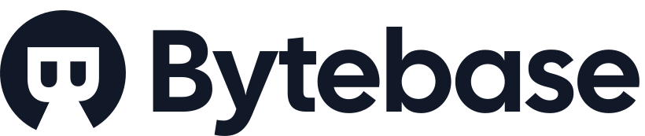

# <a href="https://bytebase.com"></a>

[](LICENSE)


[Bytebase](https://bytebase.com/) is a zero-config, dependency-free database schema change and version control tool for teams. It supports 2 mainstream schema change workflow:

- UI based SQL review
- Version control based schema migration (Database-as-Code)

### Supported database engines

- MySQL

#### Planned

- PostgreSQL

### Supported VCS

- GitLab EE/CE

#### Planned

- GitHub Enterprise
- GitLab.com
- GitHub.com

**Visit [docs.bytebase.com](https://docs.bytebase.com) for more details**

## Installation

[Detailed installation guide](https://docs.bytebase.com/install/docker)

### Run on localhost:8080

```bash
$ docker run --init --name bytebase --restart always --publish 8080:8080 --volume ~/.bytebase/data:/var/opt/bytebase bytebase/bytebase:0.1.0 --data /var/opt/bytebase --host http://localhost --port 8080
```

### Run on https://bytebase.example.com

```bash
$ docker run --init --name bytebase --restart always --publish 80:80 --volume ~/.bytebase/data:/var/opt/bytebase bytebase/bytebase:0.1.0 --data /var/opt/bytebase --host https://bytebase.example.com --port 80
```

## Development

### Prerequisites

- Go (1.16 or later)
- Yarn

### Steps

1.  Start backend (with live reload)

    ```bash
    $ air
    ```

1.  Start frontend (with live reload)

    ```bash
    $ cd frontend && yarn && yarn dev
    ```

Bytebase should now be running at https://localhost:3000 and change either frontend or backend code would trigger live reload.
