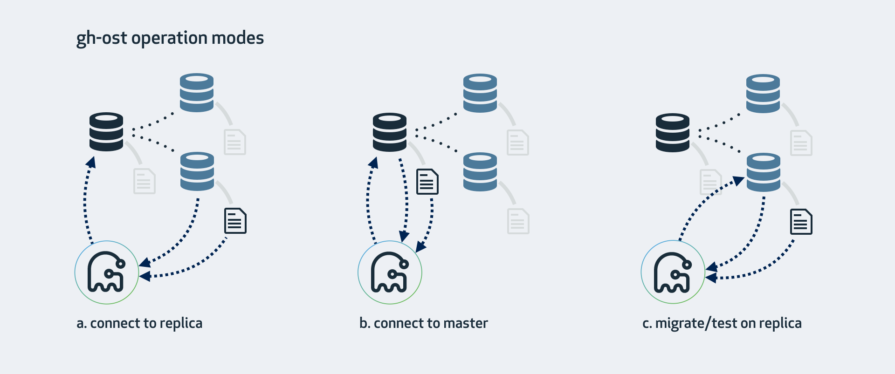
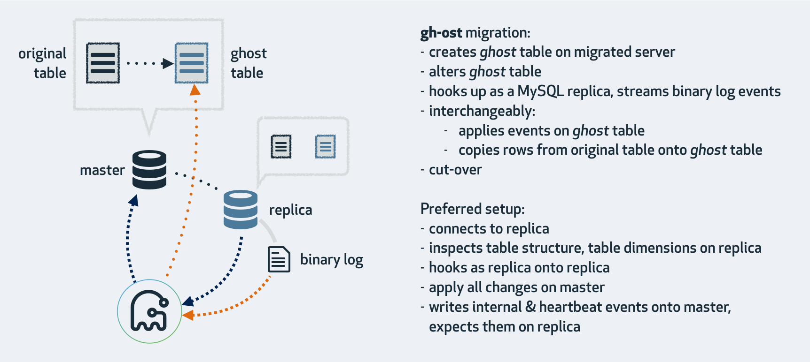

# gh-ost integration

## Overview

Currently, bytebase runs DDL statements directly on databases. With this feature, user can choose to use gh-ost to do the migration for MySQL versions 5.6 or greater.

### gh-ost: a brief introduction (quoted from gh-ost docs)

> gh-ost is a triggerless online schema migration solution for MySQL. It is testable and provides pausability, dynamic control/reconfiguration, auditing, and many operational perks.

gh-ost has 3 operation modes. It's recommended to connect to replica, migrate on primary (master). See picture below.



Here's how gh-ost migrates.



You can find usage in this [cheatsheet](https://github.com/github/gh-ost/blob/master/doc/cheatsheet.md). Below is an example.

```Bash
gh-ost \
--max-load=Threads_running=25 \
--critical-load=Threads_running=1000 \
--chunk-size=1000 \
--throttle-control-replicas="myreplica.1.com,myreplica.2.com" \
--max-lag-millis=1500 \
--user="gh-ost" \
--password="123456" \
--host=replica.with.rbr.com \
--database="my_schema" \
--table="my_table" \
--verbose \
--alter="engine=innodb" \
--switch-to-rbr \
--allow-master-master \
--cut-over=default \
--exact-rowcount \
--concurrent-rowcount \
--default-retries=120 \
--panic-flag-file=/tmp/ghost.panic.flag \
--postpone-cut-over-flag-file=/tmp/ghost.postpone.flag \
[--execute]
```

gh-ost uses the same user and password all the way up climbing the replication topology if `master-user` and `master-password` are not provided. It's the user's responsibility to set up a dedicated user with the necessary privileges for replication and gh-ost.

If gh-ost crashes halfway, we just drop the two tables created by gh-ost.

- `_yourtablename_gho`
- `_yourtablename_ghc`

After migration, we will have `yourtablename` and `_yourtablename_del`. The latter is the original table. We will ask the user to drop the original table.

Below is the output of running gh-ost on my local machine.

```Plaintext
-> % ./gh-ost --user="replica" --password="replica" --host=127.0.0.1 --port=3307 --database="db" --table="person" --alter="engine=innodb" --execute --verbose --assume-rbr
2022-03-07 09:49:39 INFO starting gh-ost 1.1.4
2022-03-07 09:49:39 INFO Migrating `db`.`person`
2022-03-07 09:49:39 INFO inspector connection validated on 127.0.0.1:3307
2022-03-07 09:49:39 INFO User has REPLICATION CLIENT, REPLICATION SLAVE privileges, and has ALL privileges on `db`.*
2022-03-07 09:49:39 INFO binary logs validated on 127.0.0.1:3307
2022-03-07 09:49:39 INFO Inspector initiated on MacBook-Air-2.local:3307, version 8.0.27
2022-03-07 09:49:39 INFO Table found. Engine=InnoDB
2022-03-07 09:49:39 INFO Estimated number of rows via EXPLAIN: 2
2022-03-07 09:49:39 INFO Recursively searching for replication master
2022-03-07 09:49:39 INFO Master found to be 127.0.0.1:3306
2022-03-07 09:49:39 INFO log_slave_updates validated on 127.0.0.1:3307
2022-03-07 09:49:39 INFO streamer connection validated on 127.0.0.1:3307
[2022/03/07 09:49:39] [info] binlogsyncer.go:133 create BinlogSyncer with config {99999 mysql 127.0.0.1 3307 replica    false false <nil> false UTC true 0 0s 0s 0 false}
2022-03-07 09:49:39 INFO Connecting binlog streamer at binlog.000001:67556
[2022/03/07 09:49:39] [info] binlogsyncer.go:354 begin to sync binlog from position (binlog.000001, 67556)
[2022/03/07 09:49:39] [info] binlogsyncer.go:203 register slave for master server 127.0.0.1:3307
[2022/03/07 09:49:39] [info] binlogsyncer.go:723 rotate to (binlog.000001, 67556)
2022-03-07 09:49:39 INFO rotate to next log from binlog.000001:0 to binlog.000001
2022-03-07 09:49:39 INFO applier connection validated on 127.0.0.1:3306
2022-03-07 09:49:39 INFO applier connection validated on 127.0.0.1:3306
2022-03-07 09:49:39 INFO will use time_zone='SYSTEM' on applier
2022-03-07 09:49:39 INFO Examining table structure on applier
2022-03-07 09:49:39 INFO Applier initiated on MacBook-Air-2.local:3306, version 8.0.27
2022-03-07 09:49:39 INFO Dropping table `db`.`_person_ghc`
2022-03-07 09:49:39 INFO Table dropped
2022-03-07 09:49:39 INFO Creating changelog table `db`.`_person_ghc`
2022-03-07 09:49:39 INFO Changelog table created
2022-03-07 09:49:39 INFO Creating ghost table `db`.`_person_gho`
2022-03-07 09:49:39 INFO Ghost table created
2022-03-07 09:49:39 INFO Altering ghost table `db`.`_person_gho`
2022-03-07 09:49:39 INFO Ghost table altered
2022-03-07 09:49:39 INFO Waiting for ghost table to be migrated. Current lag is 0s
2022-03-07 09:49:39 INFO Intercepted changelog state GhostTableMigrated
2022-03-07 09:49:39 INFO Handled changelog state GhostTableMigrated
2022-03-07 09:49:39 INFO Chosen shared unique key is PRIMARY
2022-03-07 09:49:39 INFO Shared columns are id,name,city
2022-03-07 09:49:39 INFO Listening on unix socket file: /tmp/gh-ost.db.person.sock
2022-03-07 09:49:39 INFO Migration min values: [1]
2022-03-07 09:49:39 INFO Migration max values: [2]
2022-03-07 09:49:39 INFO Waiting for first throttle metrics to be collected
2022-03-07 09:49:39 INFO First throttle metrics collected
# Migrating `db`.`person`; Ghost table is `db`.`_person_gho`
# Migrating MacBook-Air-2.local:3306; inspecting MacBook-Air-2.local:3307; executing on MacBook-Air-2.local
# Migration started at Mon Mar 07 09:49:39 +0800 2022
# chunk-size: 1000; max-lag-millis: 1500ms; dml-batch-size: 10; max-load: ; critical-load: ; nice-ratio: 0.000000
# throttle-additional-flag-file: /tmp/gh-ost.throttle
# Serving on unix socket: /tmp/gh-ost.db.person.sock
Copy: 0/2 0.0%; Applied: 0; Backlog: 0/1000; Time: 0s(total), 0s(copy); streamer: binlog.000001:69738; Lag: 0.01s, HeartbeatLag: 0.01s, State: migrating; ETA: N/A
Copy: 0/2 0.0%; Applied: 0; Backlog: 0/1000; Time: 1s(total), 1s(copy); streamer: binlog.000001:74240; Lag: 0.01s, HeartbeatLag: 0.01s, State: migrating; ETA: N/A
2022-03-07 09:49:41 INFO Row copy complete
Copy: 2/2 100.0%; Applied: 0; Backlog: 0/1000; Time: 1s(total), 1s(copy); streamer: binlog.000001:75062; Lag: 0.01s, HeartbeatLag: 0.02s, State: migrating; ETA: due
2022-03-07 09:49:41 INFO Grabbing voluntary lock: gh-ost.94.lock
2022-03-07 09:49:41 INFO Setting LOCK timeout as 6 seconds
2022-03-07 09:49:41 INFO Looking for magic cut-over table
2022-03-07 09:49:41 INFO Creating magic cut-over table `db`.`_person_del`
2022-03-07 09:49:41 INFO Magic cut-over table created
2022-03-07 09:49:41 INFO Locking `db`.`person`, `db`.`_person_del`
2022-03-07 09:49:41 INFO Tables locked
2022-03-07 09:49:41 INFO Session locking original & magic tables is 94
2022-03-07 09:49:41 INFO Writing changelog state: AllEventsUpToLockProcessed:1646617781016685000
2022-03-07 09:49:41 INFO Waiting for events up to lock
2022-03-07 09:49:41 INFO Intercepted changelog state AllEventsUpToLockProcessed
2022-03-07 09:49:41 INFO Handled changelog state AllEventsUpToLockProcessed
Copy: 2/2 100.0%; Applied: 0; Backlog: 1/1000; Time: 2s(total), 1s(copy); streamer: binlog.000001:80636; Lag: 0.01s, HeartbeatLag: 0.01s, State: migrating; ETA: due
2022-03-07 09:49:42 INFO Waiting for events up to lock: got AllEventsUpToLockProcessed:1646617781016685000
2022-03-07 09:49:42 INFO Done waiting for events up to lock; duration=989.566ms
# Migrating `db`.`person`; Ghost table is `db`.`_person_gho`
# Migrating MacBook-Air-2.local:3306; inspecting MacBook-Air-2.local:3307; executing on MacBook-Air-2.local
# Migration started at Mon Mar 07 09:49:39 +0800 2022
# chunk-size: 1000; max-lag-millis: 1500ms; dml-batch-size: 10; max-load: ; critical-load: ; nice-ratio: 0.000000
# throttle-additional-flag-file: /tmp/gh-ost.throttle
# Serving on unix socket: /tmp/gh-ost.db.person.sock
Copy: 2/2 100.0%; Applied: 0; Backlog: 0/1000; Time: 2s(total), 1s(copy); streamer: binlog.000001:81343; Lag: 0.01s, HeartbeatLag: 0.02s, State: migrating; ETA: due
2022-03-07 09:49:42 INFO Setting RENAME timeout as 3 seconds
2022-03-07 09:49:42 INFO Session renaming tables is 96
2022-03-07 09:49:42 INFO Issuing and expecting this to block: rename /* gh-ost */ table `db`.`person` to `db`.`_person_del`, `db`.`_person_gho` to `db`.`person`
2022-03-07 09:49:42 INFO Found atomic RENAME to be blocking, as expected. Double checking the lock is still in place (though I don't strictly have to)
2022-03-07 09:49:42 INFO Checking session lock: gh-ost.94.lock
2022-03-07 09:49:42 INFO Connection holding lock on original table still exists
2022-03-07 09:49:42 INFO Will now proceed to drop magic table and unlock tables
2022-03-07 09:49:42 INFO Dropping magic cut-over table
2022-03-07 09:49:42 INFO Releasing lock from `db`.`person`, `db`.`_person_del`
2022-03-07 09:49:42 INFO Tables unlocked
2022-03-07 09:49:42 INFO Tables renamed
2022-03-07 09:49:42 INFO Lock & rename duration: 1.003875334s. During this time, queries on `person` were blocked
[2022/03/07 09:49:42] [info] binlogsyncer.go:164 syncer is closing...
[2022/03/07 09:49:42] [error] binlogstreamer.go:77 close sync with err: sync is been closing...
[2022/03/07 09:49:42] [info] binlogsyncer.go:179 syncer is closed
2022-03-07 09:49:42 INFO Closed streamer connection. err=<nil>
2022-03-07 09:49:42 INFO Dropping table `db`.`_person_ghc`
2022-03-07 09:49:42 INFO Table dropped
2022-03-07 09:49:42 INFO Am not dropping old table because I want this operation to be as live as possible. If you insist I should do it, please add `--ok-to-drop-table` next time. But I prefer you do not. To drop the old table, issue:
2022-03-07 09:49:42 INFO -- drop table `db`.`_person_del`
2022-03-07 09:49:42 INFO Done migrating `db`.`person`
2022-03-07 09:49:42 INFO Removing socket file: /tmp/gh-ost.db.person.sock
2022-03-07 09:49:42 INFO Tearing down inspector
2022-03-07 09:49:42 INFO Tearing down applier
2022-03-07 09:49:42 INFO Tearing down streamer
2022-03-07 09:49:42 INFO Tearing down throttler
# Done
```

In the output, you can see the main components of gh-ost.

**Migrator** is the main schema migration flow manager.

**Inspector** reads data from the read-MySQL-server (typically a replica, but can be the master). It is used for gaining initial status and structure, and later also followup on progress and changelog.

**Streamer** reads data from binary logs and streams it on.

**Applier** connects and writes the applier-server, which is the server where migration happens. Applier is the one to actually write row data and apply binlog events onto ghost table.

**Throttler** collects metrics related to throttling and makes informed decision whether throttling should take place. Here throttling means to pause.

#### Requirements and limitations

- `gh-ost` currently requires MySQL versions 5.6 and greater.
- You will need to have one server serving Row Based Replication (RBR) format binary logs. Right now `FULL` row image is supported. `MINIMAL` to be supported in the near future. `gh-ost` prefers to work with replicas. You may still have your primary configured with Statement Based Replication (SBR).
- If you are using a replica, the table must have an identical schema between the primary and replica.
- `gh-ost` requires an account with these privileges:
  - `ALTER, CREATE, DELETE, DROP, INDEX, INSERT, LOCK TABLES, SELECT, TRIGGER, UPDATE` on the database (schema) where your migrated table is, or of course on `*.*`
  - either:
    - `SUPER, REPLICATION SLAVE` on *.*, or:
    - `REPLICATION CLIENT, REPLICATION SLAVE` on *.*
The `SUPER` privilege is required for `STOP SLAVE, START SLAVE` operations. These are used on:
- Switching your `binlog_format` to `ROW`, in the case where it is not ROW and you explicitly specified `--switch-to-rbr`
  - If your replication is already in RBR (binlog_format=ROW) you can specify --assume-rbr to avoid the STOP SLAVE/START SLAVE operations, hence no need for SUPER.
- Running --test-on-replica: before the cut-over phase, gh-ost stops replication so that you can compare the two tables and satisfy that the migration is sound.
- Foreign key constraints are not supported.
- Triggers are not supported.
Different cloud providers require different flags.
- Google Cloud SQL works, `--gcp` flag required.
- Aliyun RDS works, `--aliyun-rds` flag required.
- Azure Database for MySQL works, `--azure` flag required.

### Goals

We will enhance this feature gradually following the plan listed below in Milestone.
For the first iteration, we will implement

- Use gh-ost to execute migration
  - Support "connect to primary, migrate on primary" only

### Milestone

1.
    - Support "connect to primary, migrate on primary".
    - Support non-tenant mode.
    - Support on-premises MySQL databases.
    - Divide gh-ost execution into stages. Proceed upon user's approval.
    - Support gh-ost status feedback(ETA, configurations etc.)
1.
    - Improve migration logic to support rerun task.
    - Support workspace-level settings for gh-ost
    - Support to reconfigure gh-ost on the go.
1. Support cloud MySQL databases.
1. Support tenant mode.
1. Support "connect to replica".

## User workflow

User can set a workspace-level gh-ost configuration, which will be the default.

In UI workflow, user can select to use gh-ost, supply statements.

In VCS workflow, user commit `{{ENV_NAME}}/{{DB_NAME}}__{{VERSION}}__{{TYPE}}__{{DESCRIPTION}}.ghost.sql` to trigger gh-ost to execute migration. We use suffix to tell if it is gh-ost. The content is vanilla SQL statement.

User can change gh-ost configuration in the related issue tab.

## High level design

We will only support "connect to primary and migrate on primary" for now.

In the future, bytebase will support detecting primary and replications. We may support "connect to replica" then.

### Privileges

We will use the account `bytebase@%` in gh-ost, so `bytebase@%` will require 2 more privileges, `REPLICATION CLIENT, REPLICATION SLAVE`. We will ask user to grant these privileges in documentation.

### Reconfigure gh-ost on the go

We will support [reconfigure](https://github.com/github/gh-ost/blob/master/doc/interactive-commands.md) gh-ost settings on the go.

We will support the following parameters

- `chunk-size`
- `dml-batch-size`
- `max-lag-millis`

### Vendor

gh-ost needs to know who the cloud provider is to run properly. We will add a new field in `Instance` to store cloud provider type. User should set this field.

```Go
type Vendor string
const (
    AWS Vendor = "AWS"
    GCP Vendor = "GCP"
    Aliyun Vendor = "ALIYUN"
    Azure Vendor = "AZURE"
    SelfHost Vendor = "SELF_HOST"
)
type Instance struct {
    // omit other fields here
    // Domain specific fields
    Vendor Vendor `jsonapi:"attr,vendor"`
}
```

#### Or we speculate

Another approach is to infer cloud providers by inspecting usernames because cloud providers typically will have some default accounts to manage databases. References below.

- [GCP](https://cloud.google.com/sql/docs/mysql/users)
- [aliyunrds](https://help.aliyun.com/document_detail/161152.html)
- [azure](https://docs.microsoft.com/en-us/azure/mysql/howto-create-users)
- [aws](https://docs.aws.amazon.com/AmazonRDS/latest/UserGuide/Appendix.MySQL.CommonDBATasks.html) (Stored procedures)

### gh-ost execution stages

We will divide gh-ost execution into different tasks. Each task needs to be approved by user to proceed. These tasks are described in detail in the following sections.

1. Pre-migration check. We run gh-ost with noop flag to check user's input.
2. In-migration,
    1. After approval, gh-ost performs the migration, syncs the ghost table with the original table.
    2. After the ghost table is synced with the original table, there is a cut-over phase. We will only allow gh-ost to do the cut-over if user approved.
3. After migration, the final task is to delete the original table if user approved.

### Pre-migration validation

gh-ost has many requirements and limitations, we want to check whether gh-ost is good to go before the actual migration. To validate it, we run gh-ost with noop flag. We will return the error, if any, to user and let user handle it. This will be a new task check run type.

```Go
const TaskCheckDatabaseSchemaUpdateGhost = "bb.task-check.database.schema.update.ghost"
type TaskCheckDatabaseSchemaUpdateGhostPayload struct {
    Statement string `json:"statement,omitempty"`
    InstanceID int `json:"instanceId,omitempty"`
    DatabaseName string `json:"databaseName,omitempty"`
    TableName string `json:"tableName,omitempty"`
}
```

### In-migration progress

gh-ost can report its migration progress. Migrator can write migration status to io.Writer. [Related codes here](https://github.com/github/gh-ost/blob/master/go/logic/migrator.go#L906).

```Go
// printStatus prints the progress status, and optionally additionally detailed
// dump of configuration.
// `rule` indicates the type of output expected.
// By default the status is written to standard output, but other writers can
// be used as well.
func (this *Migrator) printStatus(rule PrintStatusRule, writers ...io.Writer) {
}
```

It's important to show user the progress, because typically it will take hours or even days to complete when migrating on large tables. We periodically update the progress in `TaskRunResultPayload.Detail`.

### Approve, run, approve, cut-over

These two tasks need to access the same `Migrator`. Unfortunately, the way we schedule tasks now is not capable of it. Go channels to the rescue! For go routines that run tasks, we will store go channels globally to communicate with them. When the ghost table catches up with the original table , the "run" task will switch to `DONE`, and the "cut over" task will be `PENDING_APPROVAL`. The "cut over" task sends `"cut-over"` to the "run" task go routine to execute cut over.

```Go
type TaskScheduler struct {
    // Channel[taskID] is the channel that sends messages to taskID
    channel map[int]chan string
}

func (s *TaskScheduler) Run() {
    for task in scheduledTaskList {
        s.channel[task.ID] = make(chan string)
        go func(task *api.Task, channel <-chan string) {
            done, result, err := executor.RunOnce(ctx, s.server, task, channel)
        }(task, s.channel[task.ID])
    }
}
```

### Crash recovery

If it crashes halfway when migrating on `tablename`, we will end up with the original `tablename`, and `_tablename_gho`, `_tablename_ghc`. We just drop `_tablename_gho` and `_tablename_ghc`, rerun gh-ost.

However, we need to refactor pre-migration validation and migration status, because the current logic doesn't allow migration to have the same version, rerun will lead to failure. We can refactor to reuse version to keep it idempotent.

Another approach is to abandon the previous version and start a new issue with a new version. The benefit is that we don't have to support rerun, so it's less complex.

For the first iteration, we just let it fail.

### After Migration

After migration is finished, we will have `tablename` and `_tablename_del`, the latter is the original table. We are too scared to delete the original table for the user, so we'll generate a task to delete the table if approved by user.

### Task dependency

Tasks under the same stage run one by one by now. With gh-ost integration, we introduce task dependency. A task can only be running if all of its dependencies are done. Tasks that are not blocked by dependencies can run in parallel.

To store the dependency relationship, we can add a field in Task.

```Go
type Task struct {
    // BlockedBy stores TaskIDs
    // Task cannot be running if not all of the BlockedBy tasks are done
    BlockedBy []int
}
```

However, we can only know the `TaskID` of a `Task` after insertion, so we have to update `Task` after all tasks in the same stage are inserted into the database.

### MigrationContext

We will introduce a new issue type for gh-ost. This is how we tell the difference between gh-ost and direct DDL.

And a new task payload type and task executor for each execution task.

```Go
// issue related

const IssueDatabaseSchemaUpdateGhost IssueType = "bb.issue.database.schema.update.ghost"

type UpdateSchemaGhostDetail struct {
    DatabaseID int `json:"databaseId"`
    DatabaseName string `json:"databaseName"`
    Statement string `json:"statement"`
    EarliestAllowedTs int64 `jsonapi:"attr,earliestAllowedTs"`
}

type UpdateSchemaGhostContext struct {
    MigrationType db.MigrationType `json:"migrationType"`
    UpdateSchemaDetailList []*UpdateSchemaGhostDetail `json:"updateSchemaDetailList`
    VCSPushEvent *vcs.PushEvent
}

// task related

const TaskDatabaseSchemaUpdateGhost TaskType = "bb.task.database.schema.update.ghost"
type TaskDatabaseSchemaUpdateGhostPayload struct {
    MigrationType db.MigrationType `json:"migrationType,omitempty"`
    Statement     string           `json:"statement,omitempty"`
    SchemaVersion string           `json:"schemaVersion,omitempty"`
    VCSPushEvent  *vcs.PushEvent   `json:"pushEvent,omitempty"`
    // more to come
}

const TaskDatabaseSchemaUpdateGhostCutover = "bb.task.database.schema.update.ghost.cutover"
type TaskDatabaseSchemaUpdateGhostCutoverPayload struct {
    // ParentTaskID references back to the gh-ost executor task ID
    ParentTaskID int `json:"parentTaskId,omitempty"`
}

const TaskDatabaseSchemaUpdateGhostDropOriginalTable = "bb.task.database.schema.update.ghost.drop-original-table"
type TaskDatabaseSchemaUpdateGhostDropOriginalTablePayload struct {
    DatabaseName string `json:"databaseName,omitempty"`
    TableName string `json:"tableName,omitempty"`
}
```

### gh-ost executor

#### How migration works now

Here's how bytebase executes migration now.

1. `server/task_scheduler.go` schedules a migration task.
2. `server/task_executor_schema_update.go` `func RunOnce()`
3. `server/task_executor.go` `func runMigration()`
4. `driver.ExecuteMigration()`
5. `util.ExecuteMigration()`

`util.ExecuteMigration` basically does the following,

```Go
func ExecuteMigration(ctx context.Context, m *db.MigrationInfo, statement string) (int64, string, error) {
    preMigration()
    defer postMigration()
    Execute(statement)
}
```

#### Use gh-ost to execute migration

Since `Execute(statement)` merely just executes the DDL statement, it should be interchangeable with gh-ost executing the migration.

We will refactor `ExecuteMigration` and export `beginMigration` and `endMigration`, so with gh-ost it will be `beginMigration`->`Migrate`->`endMigration`.

```Go
// task_executor_schema_update_ghost.go

type SchemaUpdateTaskExecutorGhost struct {
    l *zap.Logger
}

func (exec *SchemaUpdateTaskExecutor) RunOnce(ctx context.Context, server *Server, task *api.Task, channel <-chan string) (terminated bool, result *api.TaskRunResultPayload, err error) {
    PreMigration()
    ghostExecuteMigration()
    PostMigration()
}
```

## Detailed design

```Go
//task related

type TaskExecutor interface {
    RunOnce(ctx context.Context, server *Server, task *api.Task, channel <-chan string) (terminated bool, result *api.TaskRunResultPayload, err error)
}

// task check run related

const TaskCheckDatabaseSchemaUpdateGhost = "bb.task-check.database.schema-update.ghost"
type TaskCheckDatabaseSchemaUpdateGhostPayload struct {
    Statement string `json:"statement,omitempty"`
    InstanceID int `json:"instanceId,omitempty"`
    DatabaseName string `json:"databaseName,omitempty"`
    TableName string `json:"tableName,omitempty"`
}
```

```Go
// task_executor_schema_update_ghost.go
type SchemaUpdateTaskGhostExecutor struct {
    l *zap.Logger
}
func (exec *SchemaUpdateTaskGhostExecutor) RunOnce(ctx context.Context, server *Server, task *api.Task, channel <-chan string) (terminated bool, result *api.TaskRunResultPayload, err error) {
    PreMigration()
    ghostExecuteMigration()
    waitCutOver()
    PostMigration()
}

// task_executor_schema_update_ghost_cutover.go
type SchemaUpdateTaskGhostCutoverExecutor struct {
    l *zap.Logger
}
func (exec *SchemaUpdateTaskGhostCutoverExecutor) RunOnce(ctx context.Context, server *Server, task *api.Task, channel <-chan string) (terminated bool, result *api.TaskRunResultPayload, err error) {
    payload := unmarshal(task.Payload)
    parentTaskID = payload.ParentTaskID
    channel = server.TaskScheduler.channel[ParentTaskID]
    channel <- "cut-over"
}

// task_executor_schema_update_ghost_drop_original_table.go
type SchemaUpdateTaskGhostDropOriginalTableExecutor struct {
    l *zap.Logger
}
func (exec *SchemaUpdateTaskGhostDropOriginalTableExecutor) RunOnce(ctx context.Context, server *Server, task *api.Task, channel <-chan string) (terminated bool, result *api.TaskRunResultPayload, err error) {

}
```
