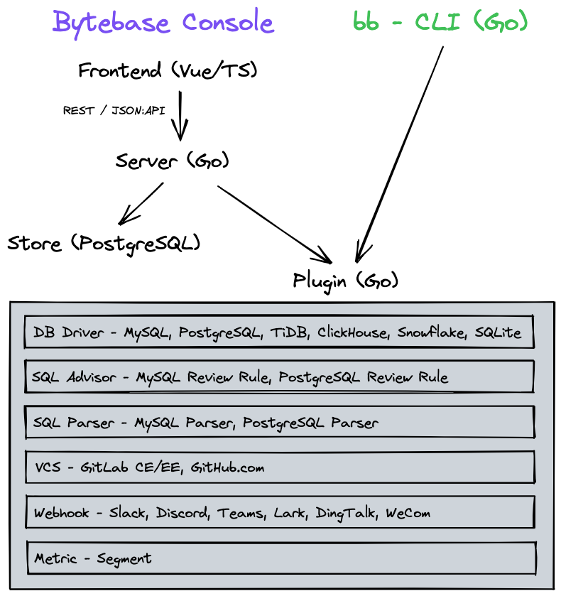

# Source Code Tour

This is [best viewed on Sourcegraph](https://sourcegraph.com/github.com/bytebase/bytebase/-/blob/docs/design/source-code-tour.snb.md).

The code snippets in this file correspond to search queries and can be displayed by clicking the button to the right of each query. For example, here is a snippet that shows off the database driver interface.

https://sourcegraph.com/github.com/bytebase/bytebase@d55481/-/blob/plugin/db/driver.go?L382-422

## Architecture Overview

## Life of a Schema Migration Change

## Namespacing

To keep a modular design, the codebase uses [reverse domain name notation](https://en.wikipedia.org/wiki/Reverse_domain_name_notation) extensively.
