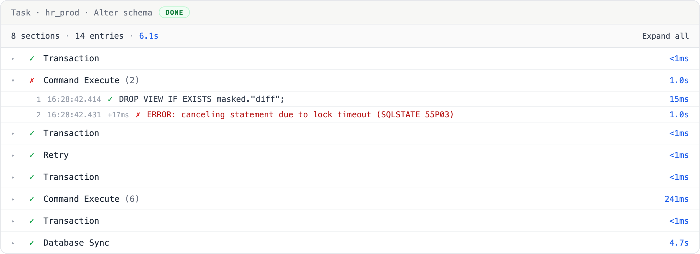
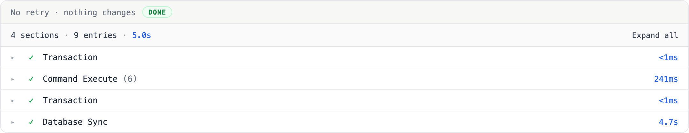
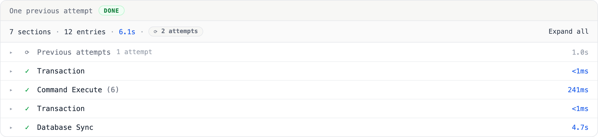
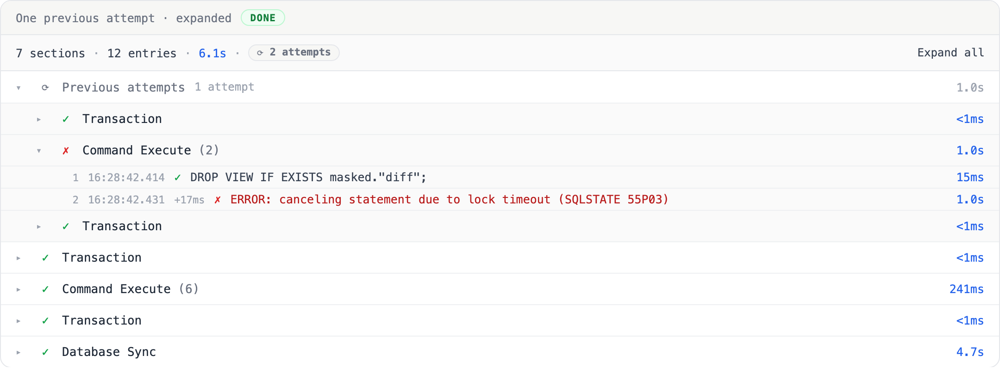
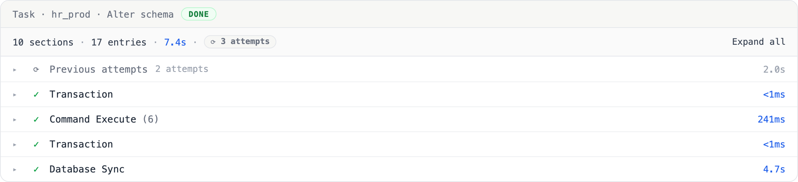
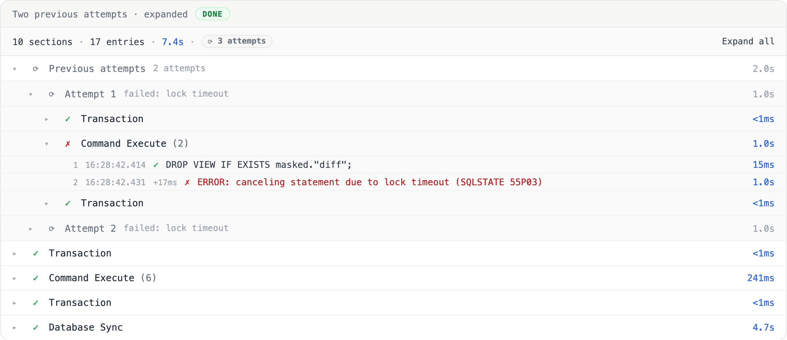
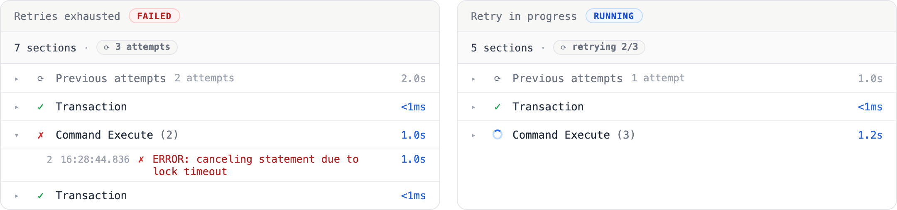
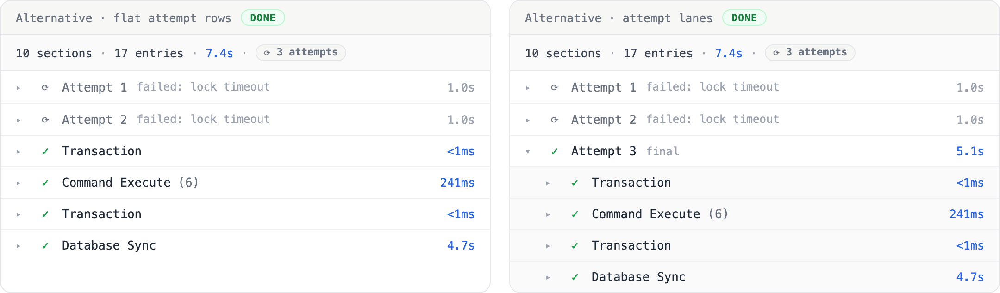
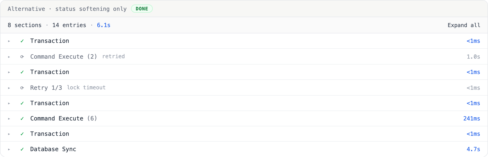

# Task run log: fold in-run retries into a Previous attempts row

When a statement fails with a retryable error such as a lock timeout, the executor
retries the whole execution inside the same task run, up to the project's
Execution retry policy maximum (the lock-timeout loop in
`backend/plugin/db/pg/pg.go`). Each attempt appends its entries to the same
`task_run_log` stream, separated by a `RETRY_INFO` marker. The log viewer groups
consecutive entries by type and renders any section containing an error as red,
auto-expanded. A run that failed once and then passed on a retry therefore keeps a
red, auto-expanded failure section forever (BYT-9993; the customer's read: the UI
is correct, but the failed step should not stay red once it passed).

Task-level re-run is not the problem and does not change: re-running a FAILED or
CANCELED task creates a new `task_run` row, and `task_run_log` is keyed by
`(project, task_run_id)`, so entries never cross runs.

## The rule

Only the final attempt's failure is state. An attempt followed by a `RETRY_INFO`
marker is superseded — its failure is the reason the retry ran — so it renders as
history: grey, collapsed, never auto-expanded, one click from the full record.

## Decision

All superseded attempts fold into a single **Previous attempts** row; the final
attempt stays flat.

- The final attempt's sections render at top level, unchanged from today, in every
  run state (DONE, FAILED, RUNNING).
- Everything before the final attempt collapses into one umbrella row in its
  chronological position, above the final attempt's sections.
- The umbrella's right-side note is the **count** ("2 attempts"). One failure
  reason cannot summarize several attempts, and the count is the first fact a
  reader wants; per-attempt reasons sit on the nested rows.
- Grey, not amber, and no fill color. The row is set apart only by a rotate icon
  and muted text. Amber is still a warning hue, and history should not catch the
  eye. Red appears only on the error entries inside the expanded record, which
  stays faithful — nothing is rewritten.
- Expanding the umbrella reveals one nested row per attempt ("Attempt 1 · failed:
  lock timeout · 1.0s"). Expanding an attempt reveals its sections with their
  original marks, the failed section pre-expanded.
- With exactly one previous attempt, expanding the umbrella goes straight to that
  attempt's sections — no middle level for a list of one. The note still reads
  "1 attempt".
- The `RETRY_INFO` marker stops rendering as a standalone green "Retry" section.
  Its payload (error, `retryCount`, `maximumRetries`) feeds the umbrella and
  nested-row labels instead.
- The summary bar gains an "N attempts" chip whenever the run has more than one
  attempt.

## States

**No retry.** No `RETRY_INFO` in the stream, so there is no umbrella row and the
rendering is exactly what it is today. Most runs look like this and are untouched.

**One previous attempt, collapsed.** The default view after a single retry: one
grey row noting "1 attempt", then the final attempt's sections flat and green.

**One previous attempt, expanded.** With a single previous attempt the umbrella
expands straight to that attempt's sections — no middle level for a list of one.
The failed section is pre-expanded and its red error entry is unchanged.

**Several previous attempts, collapsed.** Still one row; only the count changes.
The default view does not grow with the retry count.

**Several previous attempts, expanded.** The umbrella opens to one nested row per
attempt, each carrying its own reason and duration. Opening an attempt reveals its
sections.

**Terminal failure, and a retry in progress.** Left: retries are exhausted, so the
final attempt's failure is state — red and auto-expanded — while the superseded
attempts stay folded. Right: the chip reads "retrying 2/3" and the running section
streams normally.

## Rendering truth table

| Run state | Previous attempts row | Final attempt sections |
|---|---|---|
| DONE after retries | grey, collapsed | flat, green — reads like a clean run |
| FAILED after retries | grey, collapsed | flat, red; error sections auto-expand as today |
| RUNNING, retrying | grey, collapsed; summary chip reads "retrying i/N" | streams normally |
| No `RETRY_INFO` in the log | absent | unchanged rendering |

Auto-expand applies only to final-attempt error sections, narrowing today's
behavior. The umbrella and the superseded attempts never auto-expand; a superseded
failed section pre-expands only once the user opens its attempt.

## Attempt derivation contract

- Entries are already sorted by log time. Split at `RETRY_INFO` markers: the
  segment before the first marker is attempt 1, the segment between markers i and
  i+1 is attempt i+1, and the segment after the last marker is the final attempt.
  A marker belongs to no attempt's sections; it annotates the boundary.
- Derive attempts inside each replica group and each release-file group, after
  those groupings are applied. The driver retry wraps a single file's execution on
  a single connection, so a marker must not create boundaries across file or
  replica scopes.
- An empty final segment — a marker written but the retry's entries not yet
  arrived, or the run died there — renders the umbrella with no final-attempt
  sections. The run status chip carries the state.
- An attempt's duration is its segment's span; the umbrella's duration is the sum
  of its attempts' spans.
- The "N sections · M entries" summary keeps counting everything, superseded
  attempts included.
- Frontend-only. Attempt boundaries derive entirely from `RETRY_INFO` entries
  already in the stream, so no proto or backend change is required.

## Alternatives rejected

**Flat attempt rows** (left), one grey row per attempt at top level: failure
reasons read without a click, but the default view then varies with the retry
count, and for lock-timeout retries every attempt carries the same reason, which
is most of what the extra rows would show. **Attempt lanes** (right), every attempt
a labeled group in the GitHub Actions style: the clearest symmetry, but it puts a
permanent nesting level on the common success path and its final lane header
restates the run's own status chip.

**Status softening only**, keeping the flat list and marking superseded sections
grey: the smallest change, but the interleaved Transaction rows of two attempts
stay cryptic and the standalone "Retry" pseudo-section survives.

**Amber for history** was rejected everywhere, including row fills. See the color
rule above.

## Implementation outline

Implementation follows in a separate PR.

- `frontend/src/components/task-run-log/model.ts`: split entries by attempt on
  `RETRY_INFO` boundaries, and an attempt-group type whose row status is
  superseded regardless of the errors it contains, with the entries themselves
  untouched.
- `useTaskRunLogSections.ts`: a third grouping layer alongside the replica and
  release-file layers, and auto-expand restricted to final-attempt error sections.
- `TaskRunLogViewer.tsx` and `SectionHeader.tsx`: the umbrella and nested-attempt
  rows (rotate icon, muted text, count note), plus locale keys for the labels.
- Tests mirror the truth table and the marker-splitting cases: no marker, one
  marker, several markers, a marker inside a release-file group, replica-grouped
  entries, and an empty final segment.
