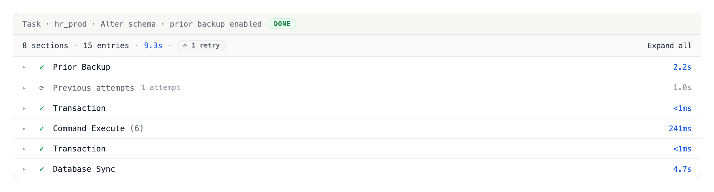
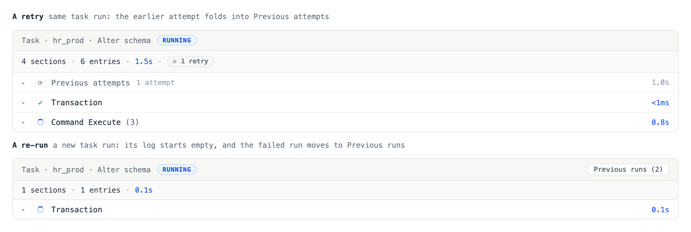
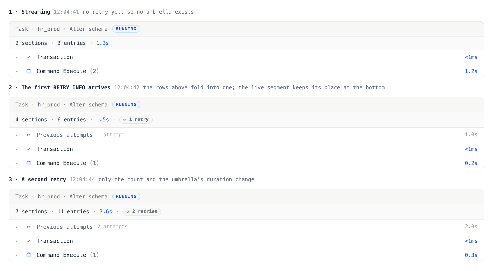
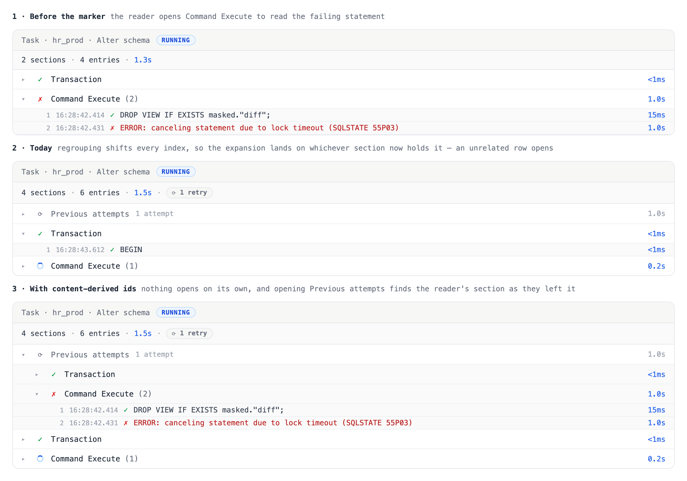

# Task run log: fold in-run retries into a Previous attempts row

When a statement fails with a retryable error such as a lock timeout, the executor
retries the whole execution inside the same task run, up to the project's
Execution retry policy maximum (the lock-timeout loop in
`backend/plugin/db/pg/pg.go`). Each attempt appends its entries to the same
`task_run_log` stream, separated by a `RETRY_INFO` marker. The log viewer groups
consecutive entries by type and renders any section containing an error as red,
auto-expanded. A run that failed once and then passed on a retry therefore keeps a
red, auto-expanded failure section forever (BYT-9993; the customer's read: the UI
is correct, but the failed step should not stay red once it passed).

Task-level re-run is not the problem and does not change: re-running a FAILED or
CANCELED task creates a new `task_run` row, and `task_run_log` is keyed by
`(project, task_run_id)`, so entries never cross runs.

## The rule

Only the final attempt's failure is state. An attempt followed by a `RETRY_INFO`
marker is superseded — its failure is the reason the retry ran — so it renders as
history: grey, collapsed, never auto-expanded, one click from the full record.

## Decision

All superseded attempts fold into a single **Previous attempts** row; the final
attempt stays flat.

- The final attempt's sections render at top level, unchanged from today, in every
  run state (DONE, FAILED, RUNNING).
- Everything before the final attempt collapses into one umbrella row in its
  chronological position, above the final attempt's sections.
- The umbrella's right-side note is the **count** ("2 attempts"). One failure
  reason cannot summarize several attempts, and the count is the first fact a
  reader wants; per-attempt reasons sit on the nested rows.
- Grey, not amber, and no fill color. The row is set apart only by a rotate icon
  and muted text. Amber is still a warning hue, and history should not catch the
  eye. Red appears only on the error entries inside the expanded record, which
  stays faithful — nothing is rewritten.
- Expanding the umbrella reveals one nested row per attempt ("Attempt 1 · failed:
  lock timeout · 1.0s"). Expanding an attempt reveals its sections with their
  original marks, the failed section pre-expanded.
- With exactly one previous attempt, expanding the umbrella goes straight to that
  attempt's sections — no middle level for a list of one. The note still reads
  "1 attempt".
- The `RETRY_INFO` marker stops rendering as a standalone green "Retry" section.
  Its payload (error, `retryCount`, `maximumRetries`) feeds the umbrella and
  nested-row labels instead.
- The umbrella sits inside the retried execution scope, not at the top of the run.
  A run can hold several such scopes — a versioned release executes each file
  separately — so each gets its own umbrella in place.
- The summary bar gains an "N retries" chip whenever the run retried at all. It
  counts `RETRY_INFO` entries across the whole run, which is the one retry number
  that stays unambiguous when several scopes each retried a different number of
  times. Per-scope counts live on that scope's umbrella.

## States

**No retry.** No `RETRY_INFO` in the stream, so there is no umbrella row and the
rendering is exactly what it is today. Most runs look like this and are untouched.

**One previous attempt, collapsed.** The default view after a single retry: one
grey row noting "1 attempt", then the final attempt's sections flat and green.

**One previous attempt, expanded.** With a single previous attempt the umbrella
expands straight to that attempt's sections — no middle level for a list of one.
The failed section is pre-expanded and its red error entry is unchanged.

**Several previous attempts, collapsed.** Still one row; only the count changes.
The default view does not grow with the retry count.

**Several previous attempts, expanded.** The umbrella opens to one nested row per
attempt, each carrying its own reason and duration. Opening an attempt reveals its
sections.

**One-time sections stay outside.** Prior backup runs once, before the retried
call, and the schema sync once after it. Neither belongs to an attempt, so both
stay at top level and keep their own durations — the umbrella sits between them,
holding only the retried execution.

**Terminal failure, and a retry in progress.** Left: retries are exhausted, so the
final attempt's failure is state — red and auto-expanded — while the superseded
attempts stay folded. Right: the chip reads "retrying 2/3" and the running section
streams normally.

## What the log stream contains

Only part of a task run's log is attempt material. The executor emits one-time
sections around the retried call, and the retry marker is written inside it, so
the stream interleaves three kinds of entry:

| Entry type | Where it is emitted | Attempt material? |
|---|---|---|
| `PRIOR_BACKUP_START` / `_END` | before `driver.Execute` | no — runs once |
| `COMPUTE_DIFF_START` / `_END` | before `driver.Execute` (declarative) | no — runs once |
| `RELEASE_FILE_EXECUTE` | before each file's `driver.Execute` | no — it opens a scope |
| `TRANSACTION_CONTROL` | inside `driver.Execute` | **yes** |
| `COMMAND_EXECUTE` | inside `driver.Execute` | **yes** |
| `RETRY_INFO` | inside `driver.Execute`'s retry loop | **yes** — it is the boundary |
| `DATABASE_SYNC_START` / `_END` | baseline changelog, and after `driver.Execute` | no — runs once |
| `GHOST_MIGRATION_START` / `_END` | replaces `driver.Execute` | no — never retried |

`DATABASE_SYNC` appears on both sides of the retried call, so position alone does
not classify an entry; the type does. Prior backup's own statements run with empty
`ExecuteOptions` and log nothing, so they cannot be mistaken for attempt material.

Retries are also narrower than they look: `LogRetryInfo` has exactly one caller,
PostgreSQL's lock-timeout loop in `backend/plugin/db/pg/pg.go`. No other engine
produces a `RETRY_INFO`, and the gh-ost path never calls `driver.Execute` at all.

## Attempt derivation contract

- **Scope.** A retried execution scope is a maximal contiguous span of attempt
  material that contains at least one `RETRY_INFO`. One-time entries before and
  after it stay at top level, in place, and never fall inside an attempt. Without
  this, an enabled prior backup — logged before the retried call — would be filed
  under attempt 1, hidden as history on a run where it actually ran once, and
  counted in that attempt's duration.
- **Split.** Within a scope, split at the `RETRY_INFO` markers: the span before
  the first marker is attempt 1, the span between markers i and i+1 is attempt
  i+1, and the span after the last marker is the final attempt. A marker belongs
  to no attempt's sections; it annotates the boundary.
- **Nesting.** Derive scopes inside each replica group and each release-file
  group, after those groupings are applied. The driver retry wraps one file's
  execution on one connection, so a marker must never create a boundary across a
  file or replica scope.
- **Empty final segment.** A marker written but the retry's entries not yet
  arrived, or the run died there, renders the umbrella with no final-attempt
  sections. The run status chip carries the state.
- **Durations.** An attempt's duration is its span; the umbrella's duration is the
  sum of its attempts' spans. One-time sections keep their own durations and are
  counted in neither.
- The "N sections · M entries" summary keeps counting everything, superseded
  attempts included.
- Frontend-only. Scopes and boundaries derive entirely from entries already in the
  stream, so no proto or backend change is required.

## Rendering truth table

Colors and auto-expansion come from the entries themselves, never from the task
run's status. The two are genuinely independent in both directions:
`runStandardMigration` logs a failed `DATABASE_SYNC` and only warns, so a **DONE**
run can hold a red final section; `runVersionedRelease` returns an error if
`UpdateDatabase` fails after a clean execution, so a **FAILED** run can hold an
all-green log.

| Condition | Previous attempts row | Sections outside it |
|---|---|---|
| An error entry in the final segment | grey, collapsed | that section red, auto-expanded |
| No error entry in the final segment | grey, collapsed | green, collapsed — reads like a clean run |
| Scope still streaming | grey, collapsed; chip reads "retrying i/N" | running section spins |
| A one-time section failed (backup, sync) | unaffected | that section red, auto-expanded, at top level |
| No `RETRY_INFO` anywhere | absent | unchanged rendering |

Auto-expand applies to error sections outside the superseded attempts — the final
segment and the one-time sections — which narrows today's behavior only by
excluding superseded material. The umbrella and the attempts inside it never
auto-expand; a superseded failed section pre-expands once the user opens its
attempt.

## Transitions

A live log is polled every five seconds, and each poll re-derives the whole view
from the full entry list. Derivation is pure over that list, so a late or
out-of-order entry needs no incremental patching — it simply re-derives. What
needs deciding is what the reader sees move, and what survives the move.

### Two "previous" things, one nested inside the other

A previous *run* never appears in the Previous attempts row. These are different
levels and only one of them is this design's subject:

| | In-run retry | Re-run |
|---|---|---|
| Created by | the driver's lock-timeout loop | a person clicking Re-run on a failed or canceled task |
| Recorded as | a `RETRY_INFO` inside one `task_run` | a new `task_run` row |
| Shown in | the Previous attempts row, inside this run's log | the task run history sheet, beside this log |

Re-running a failed task therefore does **not** put the old run into Previous
attempts; it starts a new run whose log begins empty, and the failed run moves
into the history sheet with its own log intact.

The two are easy to conflate, and the labels should carry the difference rather
than leave it to be inferred: the history button reads "History (3)" today, which
names no level. Renaming it "Previous runs (3)" pairs it with "Previous attempts"
so the unit word — run against attempt — states which level each one is. That is a
locale-only change — one key, `task-run.history-with-count`, in five locale files,
with no test or selector bound to the string — and is not otherwise part of this
work.

### What the reader sees change

| Transition | On screen | Decision |
|---|---|---|
| Run starts, no retry yet | flat sections streaming | no umbrella exists |
| First `RETRY_INFO` arrives | the sections just watched fold into a new umbrella; a fresh segment starts streaming below it | the umbrella *appears above* the live segment, so the streaming rows keep their place at the bottom and the eye does not chase them |
| A later `RETRY_INFO` arrives | the note goes "1 attempt" to "2 attempts"; the latest segment folds in | same |
| Final attempt finishes | sections settle; an error in the final segment auto-expands | decided by entries, not by run status |
| Run reaches a terminal status | the viewer remounts — its key carries the status — so everything returns to defaults | acceptable, because collapsed *is* the default |
| Someone clicks Re-run | a new `task_run`; the viewer remounts on the new name with no umbrella; the finished run moves to the history sheet | not a retry, and not this row's business |

Two existing behaviors compose with this without special handling, and are worth
stating so nobody adds handling they do not need. When a task run moved between
replicas, every replica group but the last has its still-running sections forced
to error, modelling work that was abandoned. A superseded attempt is complete by
construction — a retry followed it — so it has no running sections to force, and
only an abandoned final segment turns red, which is what the truth table already
says. And each run listed in the history sheet renders through the same viewer, so
an older run shows its own umbrella derived from its own entries.

### What must survive a poll

Expansion state already survives one. `TaskRunLogViewer` passes
`datasetKey: taskRunName` into `useTaskRunLogSections`, and `resolvedDatasetKey`
returns that before it considers the entries, so the reset fires when the viewer
shows a different task run and not when entries are appended. The entry-derived
fallback in that hook is dead code for this consumer. Nothing about the reset
needs changing.

What does not survive is the **identity of a section**. Ids are positional —
`section-${index}` — while expansion is a set of those ids. Inserting an attempt
boundary regroups the list, so a section's index changes while the set still holds
the old one. The expansion then lands on whichever section now occupies that
index: the row the reader opened closes, and an unrelated row opens in its place.

That is worse than it sounds, because the regrouping happens at exactly the moment
a reader has a reason to be reading. The first `RETRY_INFO` folds every earlier
section into the umbrella and renumbers everything after it, in one poll, while
the run is still streaming.

So this design depends on one fix in the grouping layer: derive a section's id
from what it is — its scope, attempt ordinal, entry type, and first entry's
timestamp — rather than from its position. Ids then survive regrouping, and
expansion follows the section it belongs to.

## Alternatives rejected

**Flat attempt rows** (left), one grey row per attempt at top level: failure
reasons read without a click, but the default view then varies with the retry
count, and for lock-timeout retries every attempt carries the same reason, which
is most of what the extra rows would show. **Attempt lanes** (right), every attempt
a labeled group in the GitHub Actions style: the clearest symmetry, but it puts a
permanent nesting level on the common success path and its final lane header
restates the run's own status chip.

**Status softening only**, keeping the flat list and marking superseded sections
grey: the smallest change, but the interleaved Transaction rows of two attempts
stay cryptic and the standalone "Retry" pseudo-section survives.

**Amber for history** was rejected everywhere, including row fills. See the color
rule above.

## Implementation outline

Implementation follows in a separate PR, after #21417 lands.

- `model.ts`: classify each entry as attempt material or one-time per the
  inventory above, cut scopes and attempts from that classification, and add an
  attempt-group type whose row status is superseded regardless of the errors it
  contains, with the entries themselves untouched.
- `useTaskRunLogSections.ts`: a third grouping layer alongside the replica and
  release-file layers, and auto-expand restricted to error sections outside the
  superseded attempts. Also content-derived section ids in place of positional
  ones, without which regrouping at the first marker moves a reader's expansion
  onto a different section.
- `TaskRunLogViewer.tsx` and `SectionHeader.tsx`: the umbrella and nested-attempt
  rows, plus locale keys for the labels.
- Tests mirror the truth table and the cutting cases: no marker, one marker,
  several markers, a marker inside a release-file group, several release-file
  groups retrying different numbers of times, replica-grouped entries, an empty
  final segment, and a prior-backup section that must stay outside attempt 1.
  Transition coverage asserts that a section keeps its id across the regrouping
  the first marker causes, so an expanded section stays the expanded one, and that
  the marker folds the earlier sections without disturbing the streaming segment.

### Building on #21417

That PR adds `Collapsible` / `CollapsibleTrigger` / `CollapsiblePanel` in
`frontend/src/components/ui/collapsible.tsx`, wrapping Base UI, and uses them for
the MCP capability ladder. The attempt rows should be built on the same primitive
and follow the same conventions it establishes:

- Base UI owns `aria-expanded` and `aria-controls`; the consumer supplies the
  visible label and its own indicator. Today's `SectionHeader` hand-rolls
  `aria-expanded` on a `Button` and has no `aria-controls` at all. That gap is
  survivable one level deep, but the umbrella adds a third level, which is where a
  screen-reader user most needs the control relationship stated.
- A `ChevronRight` rotated 90° when open, rather than swapping two icons, so the
  indicator animates instead of jumping.
- Row sets carry an explicit `role="list"`, because Tailwind's preflight strips
  the marker and Safari then drops list semantics — the same reason the ladder
  states it.

Migrating the existing section headers onto the primitive is the natural
follow-up and would remove the inconsistency, but it is not required by this
change and should not ride along with it.
