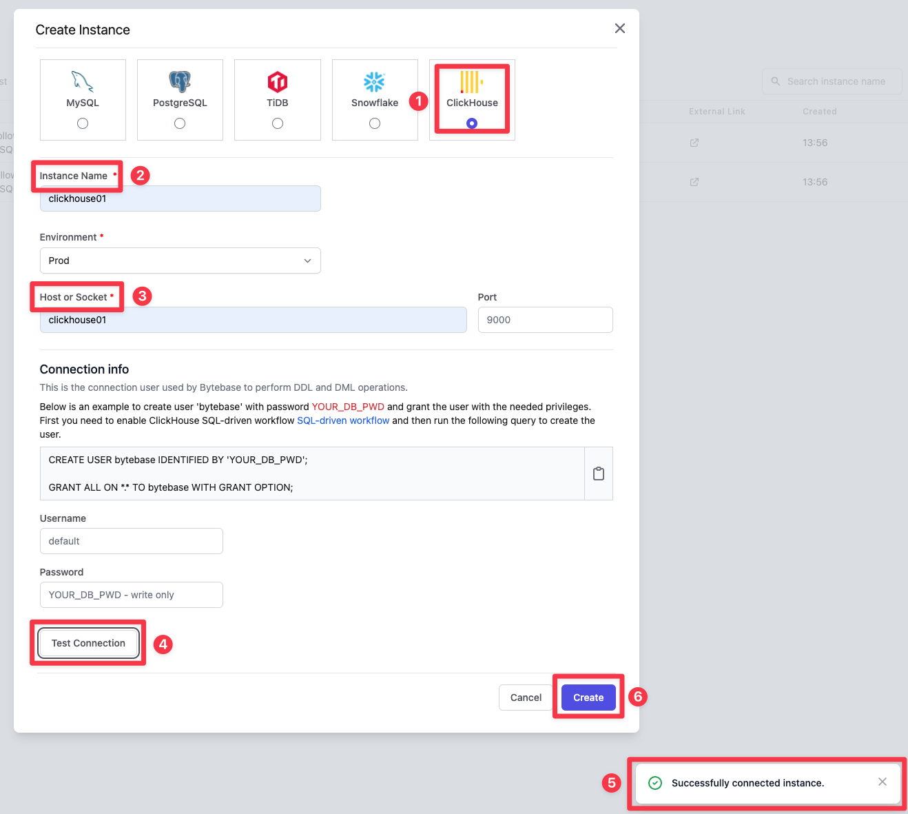
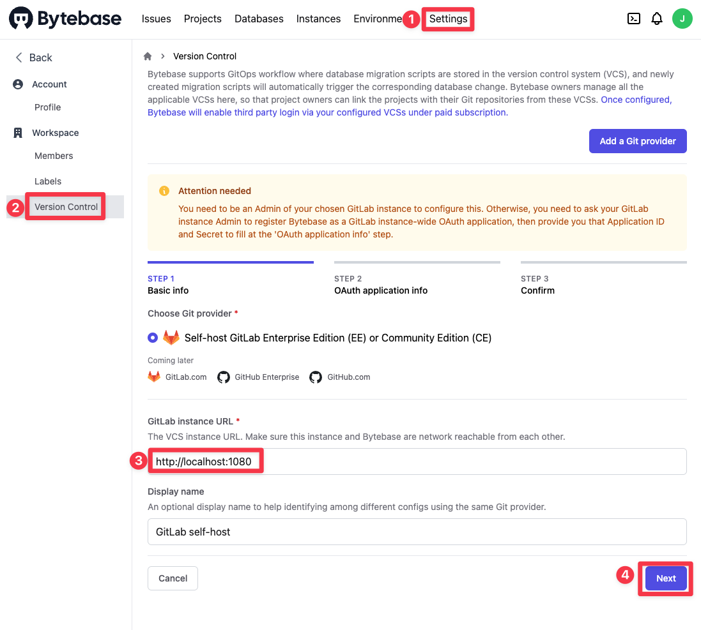
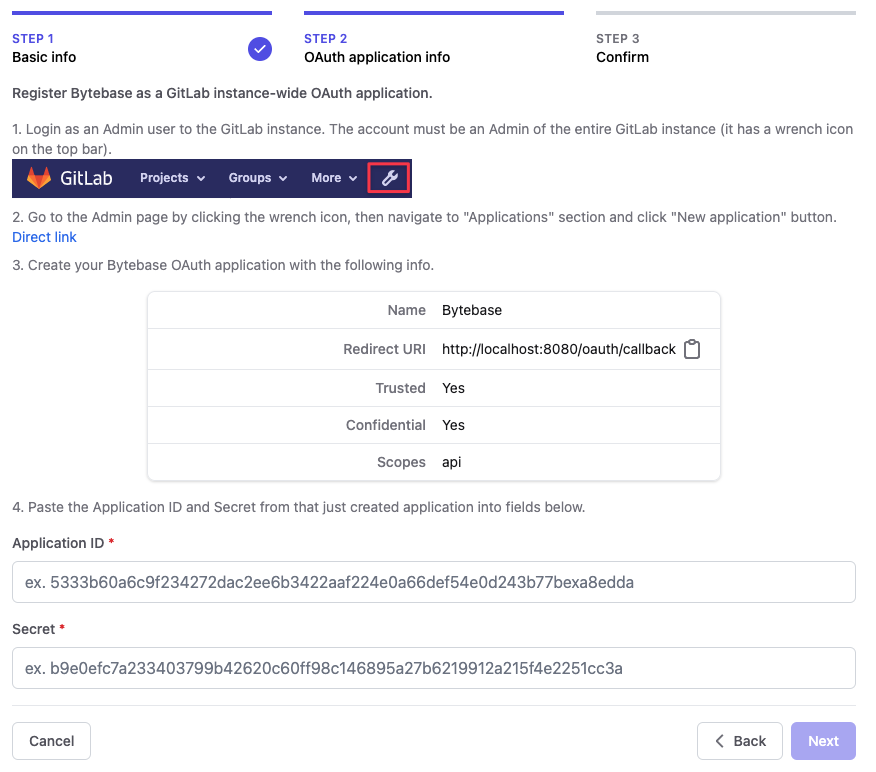
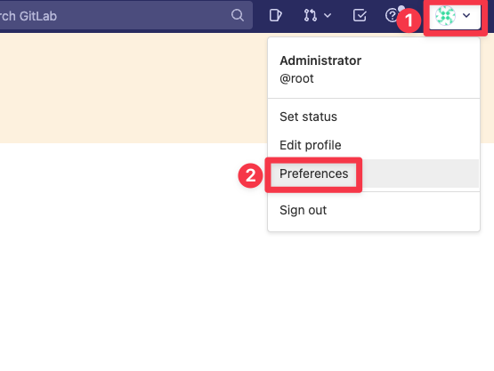
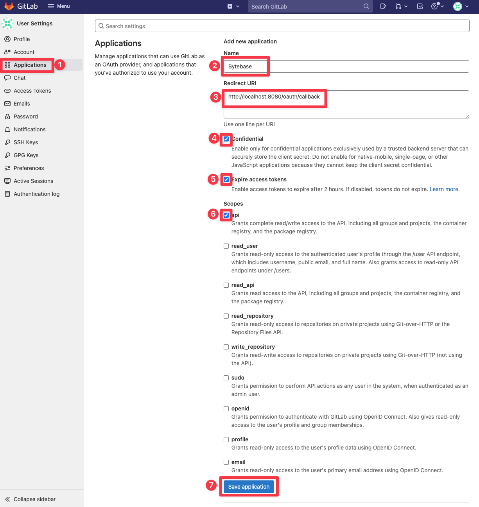
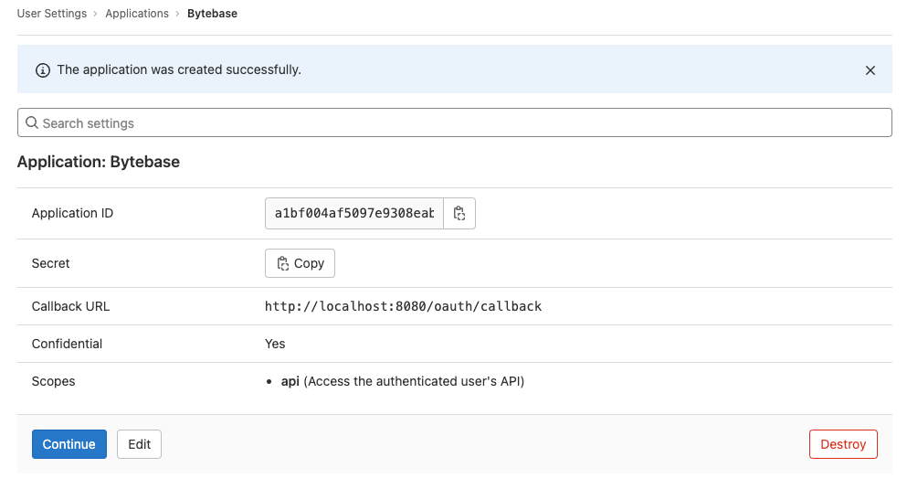
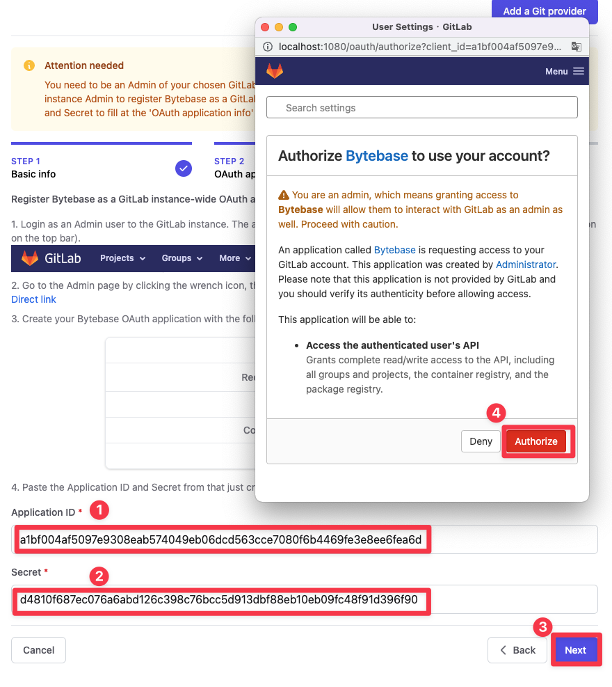

# Quickstart

This folder stores frequently used databases quickstart.

Prerequisite:

- [Docker](https://docs.docker.com/engine/install)

## MySQL

1.  ```
    git clone https://github.com/bytebase/bytebase.git && \
    cd bytebase/quickstart
    ```

1.  Compose up quickstart.

    ```
    docker compose -f mysql-quickstart.docker-compose.yml up
    ```

    After services are ready, open localhost:8080 in the browser.

1.  In `Instances`, there are 2 prepared MySQL instances both connecting to `host.docker.internal:3306`. Choose `MySQL Test`.

    Find `Connection info`, check `Empty` password, and `Test Connection`. You will see `Successfully connected instance`.
    `Update` password.

    Next `Create migration schema` (on top), and choose `Create`.

    Finally `Sync Now` (at the bottom). You should see some test databases.

## Clickhouse

1.  ```
    git clone https://github.com/bytebase/bytebase.git && \
    cd bytebase/quickstart
    ```

1.  Compose up quickstart.

    ```
    docker compose -f clickhouse-quickstart.docker-compose.yml up
    ```

    After services are ready, open localhost:8080 in the browser.

1.  `Add instance` and choose `ClickHouse`.
    Click `Test Connection`, and then you will see `Successfully connected instance`.

    \[Optional\] Set up `Instance Name` or `Environment`.

    Finially `Create` instance. You will see some test databases prepared.

## Clickhouse Cluster

1.  ```
    git clone https://github.com/bytebase/bytebase.git && \
    cd bytebase/quickstart
    ```

1.  Compose up quickstart.

    ```
    docker compose -f clickhoust-cluster-quickstart.docker-compose.yml up
    ```

    This compose file sets up a 2 shards \* 2 replica clickhouse cluster.

    After services are ready, open localhost:8080 in the browser.

1.  In `Instances`, choose `Add instance`.

    

    Choose `ClickHouse`.

    \[Optional\] Set up `Instance Name` or `Environment`.

    Enter host `clickhouse01` and then `Test Connection`. You should see `Successfully connected instance.`, and finally click `Create`.
    

    There are other 3 nodes in host `clickhouse02`, `clickhouse03` and `clickhouse04`. Repeat the steps to add them.

## GitLab (macOS Apple Silicon)

1.  ```
    git clone https://github.com/bytebase/bytebase.git && \
    cd bytebase/quickstart
    ```

1.  Compose up quickstart.

    ```
    docker compose -f gitlab-quickstart.docker-compose.yml up
    ```

    It might take several minutes for Gitlab to boot up.

1.  Visit localhost:8080, you should see Bytebase page. In `Settings` > `GitOps`, enter GitLab instance URL `http://localhost:1080`, and click `Next`.

    

1.  In step 2, you need to set up an application in GitLab.

    

    Visit localhost:1080, you should see Gitlab page. The default username/password is `root` and `bytebase`.

    After logged in, click user avatar and then `Preferences`.

    

    Follow the tips on Bytebase page to add application.

    

    Copy the Application ID and Secret to bytebase.

    

    

    Finally, `Confirm and add`. A GitLab self-host has been added as a Git provider.
